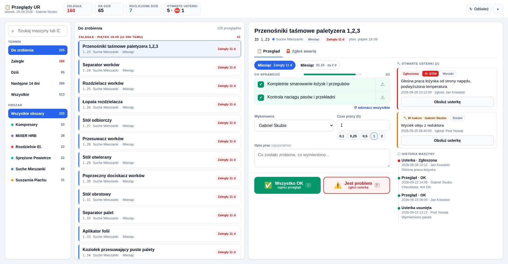
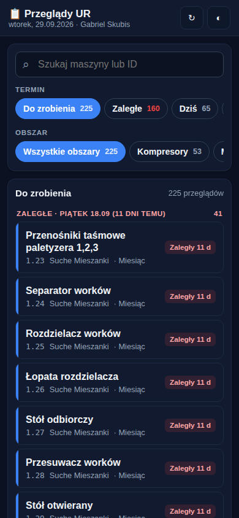
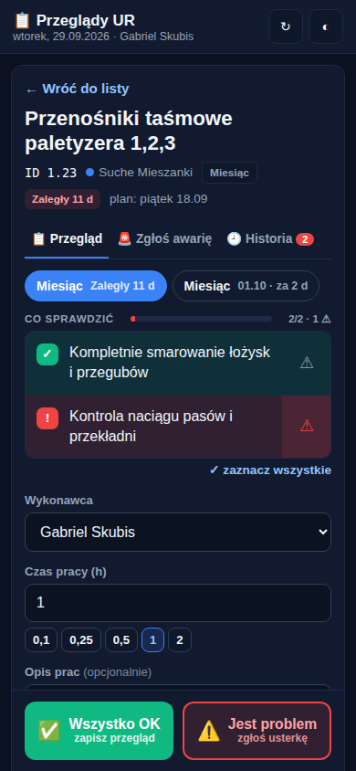

# Usprawnienia aplikacji przeglądów

## 1. Wdrożone — wersja 4.8 (interfejs przeglądu)

| Telefon — lista | Telefon — przegląd |
|---|---|
|  |  |

**Układ dopasowany do urządzenia** (`src/FormularzMobile.html`)

| Szerokość ekranu | Układ |
|---|---|
| telefon (< 900 px) | jedna kolumna: lista → przegląd; przyciski „Wszystko OK / Jest problem” przyklejone do dołu ekranu |
| tablet, mały laptop (900–1399 px) | lista z filtrami po lewej, przegląd po prawej |
| laptop / monitor (≥ 1400 px) | trzy panele na całą wysokość i szerokość: filtry · lista · przegląd; przy szerokim panelu przeglądu historia maszyny i otwarte usterki widoczne obok checklisty |

**Nowe funkcje**

- **Checklista do odhaczania** — każdy punkt zakresu można zaznaczyć ✓ albo oznaczyć ⚠ jako problem; pasek postępu. Punkty z ⚠ trafiają automatycznie do opisu usterki, a kliknięcie „Wszystko OK” przy zaznaczonym ⚠ otwiera zgłoszenie problemu. Do opisu prac dopisuje się „Checklista: 4/5 OK, 1 z problemem” — ślad audytowy w Rejestrze.
- **Kafle w nagłówku (laptop)** — zaległe, na dziś, rozliczone dziś, otwarte usterki i liczba stojących maszyn; kliknięcie kafla filtruje listę.
- **Filtry obszarów z licznikami i kolorami**, zapamiętywane na urządzeniu.
- **Historia maszyny i otwarte usterki przy każdym przeglądzie** (nie tylko po skanie QR) — z laptopa można też obsłużyć/zamknąć usterkę i zgłosić awarię wybranej maszyny.
- **Kilka przeglądów tej samej maszyny** (np. zaległy i bieżący) — przełącznik nad checklistą.
- **Szybki wybór czasu pracy** (0,1 / 0,25 / 0,5 / 1 / 2 h).
- **Laptop: po zapisie od razu otwiera się następny przegląd**; telefon: powrót do listy z przyciskiem „Następna”.
- **Skróty klawiszowe**: ↑/↓ poprzedni/następny, `/` szukaj, `O` wszystko OK, `P` jest problem, `A` zgłoś awarię, `Enter` potwierdza komunikat DTR, `Esc` anuluj/wróć, `R` odśwież.
- **Motyw jasny i ciemny** — domyślnie wg systemu, przełącznik w nagłówku.
- **Menu arkusza: „🖥️ Otwórz aplikację przeglądów (pełny ekran)”** — otwiera Web App w nowej karcie zamiast okna 1000×680 px.

**Serwer** (`src/Code.gs`): `pobierzStatystykiPrzegladow()` (kafle), `pobierzUsterkiIHistorieMaszyny(id, limit)` (dłuższa historia — domyślnie 12 zdarzeń), `otworzAplikacjePrzegladow()`.

**Poprawki z audytu**: K2 (ucieczka `</script>` w `FormularzPrzegladu.html` i `PanelZarzadu.html`), K3 (dane z formularzy w e-mailach przechodzą przez `escHtml_`).

Bez zmian: sposób zapisu do arkuszy, komunikat DTR, struktura kolumn, kody QR i adresy aplikacji.

### Jak wdrożyć

1. Skopiuj do edytora Apps Script: `Code.gs`, `FormularzMobile.html`, `FormularzPrzegladu.html`, `PanelZarzadu.html` (linki „Raw” w [README](../README.md)).
2. **Deploy → Manage deployments → ✏️ → Version: New version → Deploy.** Bez tego telefon i link z QR dalej pokazują starą wersję.
3. Odśwież arkusz (F5) — pojawi się nowa pozycja menu.

## 1a. Wdrożone — wersja 4.9 (wykonawca z konta Google)

- W arkuszu „6. Pracownicy” jest kolumna **Email** (dodawana automatycznie; maile, które wcześniej trafiały do kolumny „Rola”, zostają do niej przeniesione).
- Aplikacja rozpoznaje technika po koncie Google: najpierw po mailu z kolumny Email, potem po nazwisku z maila (`jan.kowalski@…` → Jan Kowalski) — bez polskich znaków, wielkości liter i kolejności słów, więc `lukasz.zolnierczyk@…` trafia w „Łukasz Żołnierczyk”.
- **Zalogowany technik ma pierwszeństwo** jako wykonawca i zgłaszający; osoba zapamiętana na telefonie jest tylko zapasem. Zalogowany widać w nagłówku (👤).
- Konto spoza listy dopisuje się ze statusem **DO ZATWIERDZENIA** (żółte tło) — ta osoba może rozliczać siebie, ale nie pojawia się na listach wyboru innych, dopóki kierownik nie ustawi TAK (albo NIE dla kont wspólnych/przypadkowych).
- Filtry terminu i obszaru zawijają się do kolejnych wierszy zamiast chować się za krawędzią.

Warunek: Google podaje mail tylko, gdy aplikację wdrożyło konto z tej samej domeny co technik (np. oba @holcim.com) albo Web App działa jako „User accessing the web app”. Po wdrożeniu uruchom raz menu „👷 Utwórz / uporządkuj listę pracowników”, żeby dodać listę wyboru z nowym statusem i formatowanie.

## 2. Propozycje kolejnych usprawnień

Kolejność = stosunek wartości do nakładu pracy. „Filar” wskazuje, do którego celu SMART się przyczynia.

### Szybkie (dni)

| # | Usprawnienie | Po co | Filar |
|---|---|---|---|
| 1 | **Kroczący horyzont harmonogramu** (audyt K1) — wyzwalacz dopisuje przeglądy na +90 dni zamiast sztywnego 31.12.2026 | od 1.01.2027 system przestanie planować | CMMS |
| 2 | **Zdjęcie do zgłoszenia usterki** (aparat telefonu → Dysk Google, link w arkuszu) | szybsza diagnoza, dokumentacja stanu | CMMS / AI |
| 3 | ~~Lista pracowników zatwierdzana przez kierownika~~ — zrobione w V4.9 | czyste dane wykonawców | CMMS |
| 4 | **Odbiorcy powiadomień z arkusza** (per obszar, zastępstwa) zamiast jednego adresu w kodzie (W5) | nikt nie przegapi awarii | CMMS |
| 5 | **Powód zaległości** przy rozliczaniu po terminie (brak czasu / maszyna pracuje / brak części) | analiza, dlaczego plan nie jest realizowany | CMMS |

### Średnie (1–3 tygodnie)

| # | Usprawnienie | Po co | Filar |
|---|---|---|---|
| 6 | **Części zamienne na usterce** — wybór z indeksu magazynowego zamiast wolnego tekstu, ilość, stan | pierwszy most CMMS ↔ WMS, koszt napraw | CMMS + WMS |
| 7 | **Widok planisty (laptop)** — kalendarz tygodnia/miesiąca, przeciąganie przeglądów, obciążenie techników | planowanie zamiast gaszenia pożarów | CMMS |
| 8 | **Kolejka offline** — zapis bez zasięgu trafia do telefonu i wysyła się sam po odzyskaniu sieci (z ochroną przed podwójnym zapisem) | hala, słaby zasięg | CMMS |
| 9 | **Raport tygodniowy e-mail** — realizacja planu, zaległości wg obszaru, top usterek, przestoje | KPI bez otwierania arkusza | CMMS |
| 10 | **Pomiary na checkliście** (temperatura, ciśnienie, poziom oleju) z progami alarmowymi | dane do predykcji | CMMS / AI |

### Moduły AI (po zebraniu danych)

| # | Usprawnienie | Po co |
|---|---|---|
| 11 | **Zgłoszenie głosem / zdjęciem** → AI rozpoznaje maszynę, kategorię, priorytet i proponuje części; technik zatwierdza | cel „automatyzacja zgłoszeń” |
| 12 | **Podpowiedź przy awarii** — podsumowanie historii maszyny i poprzednich napraw | szybsza naprawa, wiedza nie ginie z odejściem ludzi |
| 13 | **Ranking ryzyka maszyn** na podstawie historii NOK, usterek, przestojów i pomiarów | cel „predykcja awarii” |

Do 11–13 potrzebna jest decyzja o dostawcy modelu AI i polityce danych (patrz [06-otwarte-pytania.md](06-otwarte-pytania.md), pkt 7).
